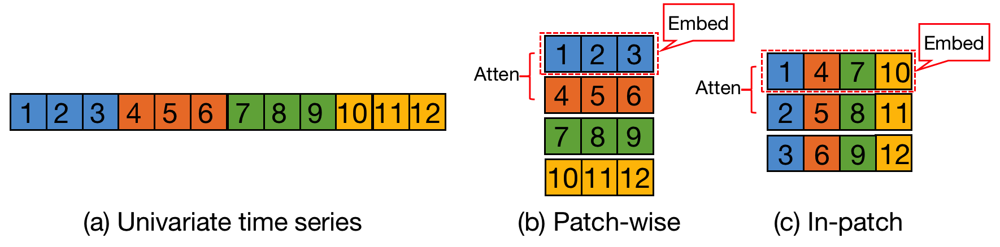
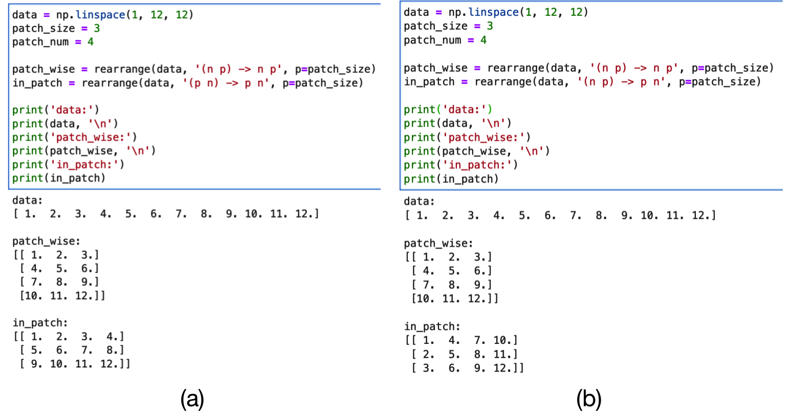

# Result

| Dataset | Precision | Recall |   F1   |
|:-------:|:---------:|:------:|:------:|
|   SMD   |  0.4941   | 0.2275 | 0.3116 |

# Issue

While reading the [official code](https://github.com/DAMO-DI-ML/KDD2023-DCdetector) and attempting to implement it
independently, I identified several issues:

- The definitions of the loss function and the anomaly score do not match Equation (9) and Equation (10) in the paper.
  The official code uses a simplified version of what [AnomalyTransformer](https://github.com/thuml/Anomaly-Transformer)
  uses. Correspondingly, the way employed for threshold determination in the official code diverges from the approach
  outlined in Section 4.3 of the paper.
- The official code for computing $\operatorname{Attn}_{\mathcal{N}_i}$ and $\operatorname{Attn}_
  {\mathcal{P}_i}$ does not match the equations (2) and (5) in the paper. The denominator in the paper is $\sqrt{d_
  {\text {model }}}$, while in the code it is $\sqrt{\frac{d_{\text {model }}}{H}}$.

- There seems to be an error in the official code when splitting the patches. For the univariate time series in Figure (
  a), its Patch-wise and In-patch embedding should be as shown in Figure (b) and Figure (c), respectively.

  

  The official code can't do this as shown in Figure (a), and the correct one is shown in Figure (b):

  

- The official code does not seem to sum the representations of multiple patch sizes according to equations (7) and
  equations (8) in the paper, instead it sums the their KL divergence distances when calculating the loss. As far as we
  know, these two operations are not equivalent.
- Equation (3) and Equation (6) in the paper seem to be wrong.
    - The official code does not concat the multiple heads as stated in the paper, but averages them after evaluating
      their respective KL divergence.
    - There is no $W_{\mathcal{N}}^O$ and $W_{\mathcal{P}}^O$ in the official code. In fact, this multiplication does
      not work at all. $\operatorname{Attn}_{\mathcal{N}}$ [$\operatorname{Attn}_{\mathcal{P}}$] has a shape of $B\times
      H\times N \times N$ [$B\times H\times P \times P$], and it cannot be multiplied at all by a $W_
      {\mathcal{N}}^O$ [$W_{\mathcal{P}}^O$] with a shape of $d_{\text {model }} \times d_{\text
      {model }}$[$d_{\text {model }} \times d_{\text {model }}$], concated or not.
- Each attention layer in the encoder has an input shape of $(BC)\times H\times P\times
  P$  [$(BC)\times H\times N\times N$]and an output shape of $B \times H \times (NP)\times (
  NP)$ [$B \times H \times (NP)\times (NP)$)]. Because of the inconsistent shapes, the individual attention layers
  cannot be connected in series, and the official code uses a parallel approach and sums the KL divergence of the
  different attention layers. This is not mentioned at all in the paper.